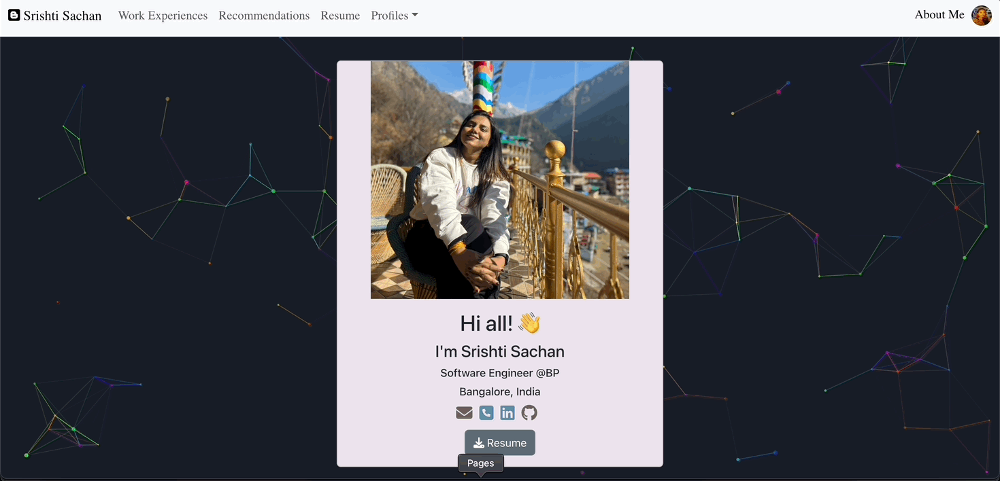

### Portfolio - Srishti Sachan

### [🔗Live Demo🔗](https://white-rabbit10.github.io/)

## Features

**📖 Multi-Page Layout**

**🎨 Styled with Reactstrap**

**📱 Fully Responsive**

 

## 🚀 How to get started?

Clone down this repository. You will need `node.js` and `git` installed globally on your machine.

 

## 🛠 Installation and Setup Instructions
1. Installation: `npm install`

2. In the project directory, you can run: `npm run start`

Runs the app in the development mode.\
Open [http://localhost:3000](http://localhost:3000) to view it in the browser.
The page will reload if you make edits.

 

## Contribution
I do not accept any direct contributions to this project like pull requests or implementation changes. However, if you have any suggestions or ideas feel free to message me or submit an idea in the discussions. Otherwise, you can fork this project and change it for your own purposes.

## License
This project is released under the MIT LICENSE. You can find the specific terms and conditions outlined in the LICENSE file. This means you're free to utilize, modify, and distribute the project according to the terms of the MIT License.

### Build Your Portfolio:
Feel free to incorporate this project into your personal portfolio! Showcase your skills and creativity by featuring your adaptations or implementations of this project. Just make sure to follow the guidelines of the MIT License while doing so.

Happy coding!

<h1 align=center> Happy coding! </h1>
